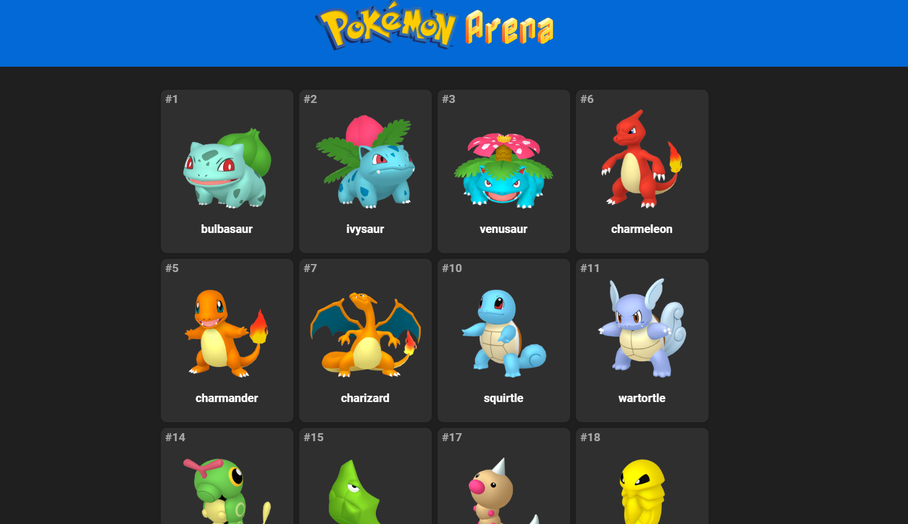
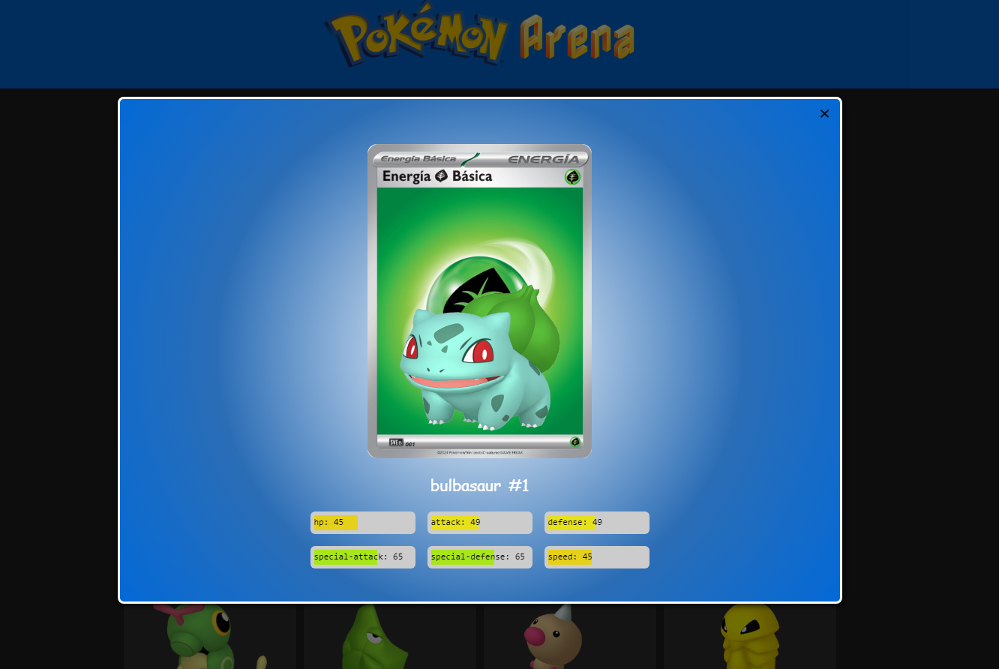

<h1> Pokemon Arena 🚀</h1>
<h2> V1 🛠</h2>

> Criando uma arena pokemon

Construido uma arena pokemon utilizando pokeAPI, no momento feito apenas a V1 que contém homepage, paginação, modal de detalhes do pokemon selecionado e status do mesmo.

## O que foi criado 
+ Home page
+ Páginação
+ Modal com detalhes do pokemon
+ Responsividade
+ Integração com PokeAPI
+ Conversões de dados
+ Deploy da pagina com github pages

## Tecnologias

+ Javascript vanilla
+ HTML
+ CSS

## Página Piloto

https://rodgondin.github.io/Pokemon-arena/
